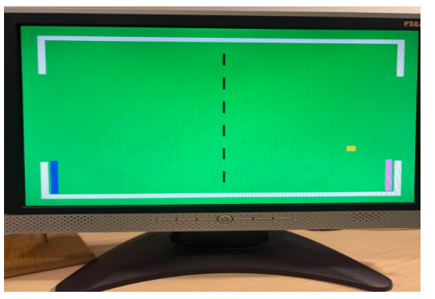
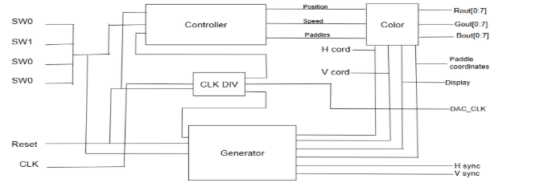
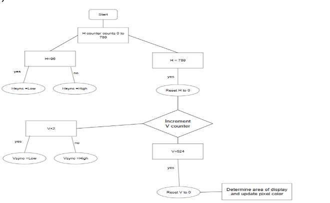
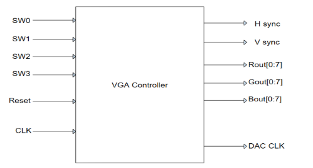

# FPGA Pong Game Processor – VHDL VGA Implementation

**Description**  
VHDL-based **Simple Video-Game Processor** (SVGP) that implements a Pong-style game for VGA output on the Xilinx Spartan-3E FPGA.   

This project features real-time VGA signal generation, collision-based ball physics, switch-controlled paddles, and scoring logic (ball turns red and respawns after passing a gate). The full project specification is included https://www.ee.torontomu.ca/~lkirisch/ele758/labs/SimpleVideoGame[11-11-11].pdf

**Overview**  
The goal was to design and implement a complete real-time video game system in VHDL on the Xilinx Spartan-3E FPGA, focusing on VGA interfacing, on-chip logic for graphics and physics, and external I/O control via board switches.  

Key features:  
- Static green game field with white borders  
- Dynamic yellow ball with velocity and 90° reflection on border/player collision  
- Left (blue) and right (pink) paddles moved up/down using on-board switches  
- Scoring: Ball passing left/right gate turns red, disappears briefly, and respawns in center as yellow  
- VGA controller generating 640×480 @ 60 Hz timing (25 MHz pixel clock derived from 50 MHz input)  

The design demonstrates synchronous digital logic, state machines for game behavior, collision detection, and proper HSync/VSync/RGB signal generation. Hardware testing on the Spartan-3E board confirmed smooth gameplay, accurate reflections, and reliable video output.

**Demo Screenshots**  

**Design Details**  

### Block Diagram  

### Process / State Machine Diagram    

### State Diagram  

**Technologies & Tools**  
- **Language**: VHDL  
- **Development Environment**: Xilinx ISE (synthesis, simulation, implementation)  
- **Target Hardware**: Xilinx Spartan-3E FPGA Starter Kit  
- **Clock**: 50 MHz onboard → divided to 25 MHz VGA pixel clock  
- **I/O**: VGA (HSync, VSync, 8-bit RGB via DAC), on-board switches for paddle control  

**VGA Timing Parameters** (640×480 @ 60 Hz)

**Horizontal**  

| Parameter          | Clock Cycles |
|--------------------|--------------|
| Complete Line      | 800          |
| Front Porch        | 16           |
| Sync Pulse         | 96           |
| Back Porch         | 48           |
| Active Image Area  | 640          |

**Vertical**  

| Parameter          | Lines |
|--------------------|-------|
| Complete Frame     | 525   |
| Front Porch        | 10    |
| Sync Pulse         | 2     |
| Back Porch         | 33    |
| Active Image Area  | 480   |

